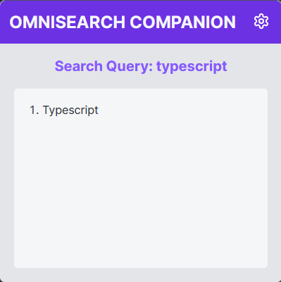
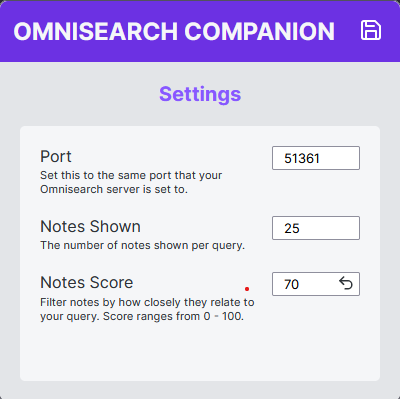

## Omnisearch Companion

This extension displays relevant notes using the powerful [Omnisearch](https://github.com/scambier/obsidian-omnisearch) plugin for Obsidian from your browser. You can search your Obsidian vault while searching the web and quickly open the results in Obsidian.

 

## Installation

- Install the Omnisearch plugin for Obsidian and enable the local HTTP server option
- Set your preferred port (default port is 51361)
- Enjoy passively searching your vault!

## Build from Source
- npm install
- npm run build
- npm run start

### Alternatively

- npm install
- npm run parcel-start
- install extension temporarily at `about:debugging#/runtime/this-firefox`