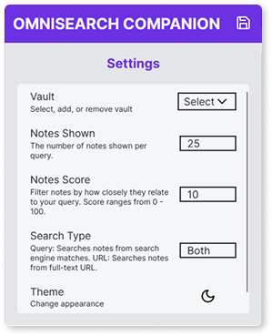

# Omnisearch Companion

This extension displays relevant notes using the powerful [Omnisearch](https://github.com/scambier/obsidian-omnisearch) plugin for Obsidian from your browser. You can search your Obsidian vault while searching the web and quickly open the results in Obsidian.

 

## Permissions Notice

### Tabs

The tabs permission is required to retrieve URL queries which Omnisearch uses to determine which notes to fetch.

### Storage

The storage permission is required to store settings for user customization and plugin function.

### Notifications

The notifications permission is required to display important messages like errors.

## Installation

The plugin is available for both Firefox and Chrome browsers.

- [Firefox](https://addons.mozilla.org/en-US/firefox/addon/omnisearch-companion/)
- [Chrome](https://chromewebstore.google.com/detail/omnisearch-companion/kcjcnnlpfbilodfnnkpioijobpjhokkd)

After installing the plugin:

- Install the Omnisearch plugin for Obsidian and enable the local HTTP server option
- Set your preferred port (default port is 51361)
- Enjoy passively searching your vault!

## Build from Source

Firefox

- npm `export-ff`

Chrome

- npm `export-cr`
